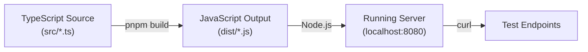

# Coda MCP - Build Strategy & Architectural Decisions

**Document Purpose**: Document the build strategy, architectural decisions, and deployment infrastructure for the Coda MCP HTTP-native server

**Audience**: DevOps engineers, integration engineers, and future maintainers

**Date**: November 2, 2025

---

## Table of Contents

1. [Architecture Overview](#architecture-overview)
2. [Technology Stack](#technology-stack)
3. [Build Process](#build-process)
4. [Deployment Strategy](#deployment-strategy)
5. [Network & Security](#network--security)
6. [Client Integration](#client-integration)
7. [Monitoring & Operations](#monitoring--operations)

---

## Architecture Overview

### High-Level Design

```
┌─────────────────────────────────────────────────────────────────┐
│                        Users / Clients                           │
│              (CLI, Claude Desktop, ChatGPT, SDKs)                │
└─────────────────────────┬───────────────────────────────────────┘
                          │
                          │ HTTPS
                          │
┌─────────────────────────▼───────────────────────────────────────┐
│                   Cloudflare Tunnel                              │
│         (Encrypted connection to droplet via tunnel)             │
└─────────────────────────┬───────────────────────────────────────┘
                          │
                          │ HTTP (internal to droplet)
                          │
┌─────────────────────────▼───────────────────────────────────────┐
│                   Nginx Reverse Proxy                            │
│         (Port 80/443, SSL termination, routing)                  │
└─────────────────────────┬───────────────────────────────────────┘
                          │
                          │ HTTP localhost:8080
                          │
┌─────────────────────────▼───────────────────────────────────────┐
│            Coda MCP HTTP-Native Express Server                   │
│                      (Port 8080)                                 │
│                                                                   │
│  ┌────────────────────────────────────────────────────────────┐ │
│  │ Endpoints:                                                 │ │
│  │ - GET  /health                    (health check)           │ │
│  │ - POST /mcp (with Bearer token)    (initialize session)    │ │
│  │ - GET  /mcp (SSE stream)           (receive results)       │ │
│  │ - DELETE /mcp                      (terminate session)     │ │
│  │ - POST /oauth/register             (client registration)   │ │
│  │ - GET /.well-known/oauth-*         (OAuth discovery)       │ │
│  └────────────────────────────────────────────────────────────┘ │
│                          ↓                                       │
│  ┌────────────────────────────────────────────────────────────┐ │
│  │ StreamableHTTPTransport (MCP SDK)                          │ │
│  │ - Session management (one transport per session)           │ │
│  │ - Tool dispatch and execution                              │ │
│  │ - Response streaming via SSE                               │ │
│  └────────────────────────────────────────────────────────────┘ │
│                          ↓                                       │
│  ┌────────────────────────────────────────────────────────────┐ │
│  │ Coda API Client (coda.io SDK)                              │ │
│  │ - Authenticated requests to https://coda.io/apis/v1       │ │
│  │ - Tool implementations (40+ tools available)               │ │
│  └────────────────────────────────────────────────────────────┘ │
└─────────────────────────────────────────────────────────────────┘
```

### Key Architectural Principles

1. **HTTP-Native Implementation**
   - No stdio transport; uses HTTP for all communication
   - Enables web client integration (Claude Desktop, ChatGPT)
   - Stateless server with session management via `Mcp-Session-Id` header

2. **Bidirectional Streaming (SSE)**
   - Tool requests: POST /mcp (stateless)
   - Tool results: GET /mcp with SSE (stateful stream)
   - Both use same session ID to correlate request/response

3. **Bearer Token Authentication**
   - Each request includes Coda API token
   - Server configures Coda client per request (multi-tenant)
   - Enables different users to use same server instance

4. **Session Isolation**
   - One StreamableHTTPServerTransport per session
   - Sessions expire after 5 minutes of inactivity
   - Prevents state leakage between concurrent users

5. **Token Budgeting**
   - Estimates response tokens before sending
   - Prevents context window overflow
   - Formula: 1 token ≈ 4 characters (rounded up to 50)

6. **Reverse Proxy for Web Clients**
   - Nginx bridges web clients and internal HTTP server
   - Handles SSL/TLS termination
   - Enables domain-based access (coda.bestviable.com)

---

## Technology Stack

### Core Technologies

| Component | Version | Purpose |
|-----------|---------|---------|
| **Node.js** | 23 (Alpine) | JavaScript runtime |
| **Express.js** | ^4.18.0 | HTTP server framework |
| **TypeScript** | ^5.0.0 | Type-safe development |
| **MCP SDK** | @modelcontextprotocol/sdk | MCP protocol implementation |
| **Coda SDK** | Generated from OpenAPI | Coda API client |

### Build & Deployment

| Component | Version | Purpose |
|-----------|---------|---------|
| **pnpm** | Latest | Package manager (faster than npm) |
| **Docker** | 20.10+ | Container runtime |
| **Nginx** | 1.29.2+ | Reverse proxy & SSL termination |
| **Cloudflare Tunnel** | Latest | Secure tunnel to droplet |

### Development Tools

| Component | Version | Purpose |
|-----------|---------|---------|
| **Vitest** | ^0.34.0 | Unit testing |
| **TypeScript Compiler** | ^5.0.0 | Type checking & compilation |
| **Prettier** | ^3.0.0 | Code formatting |

---

## Build Process

### Local Development Build



### Steps

```bash
# 1. Install dependencies
pnpm install

# 2. Build TypeScript to JavaScript
pnpm build
# Creates dist/ directory with compiled code

# 3. Run locally
node dist/http-server.js
# Server listens on port 8080

# 4. Test endpoints
curl http://localhost:8080/health

# 5. Kill process when done
Ctrl+C
```

### Docker Build (Multi-Stage)

```dockerfile
# Stage 1: Builder
# - Installs all dependencies
# - Compiles TypeScript to JavaScript
# - Creates optimized dist/ output
# Result: Large intermediate image with build tools

# Stage 2: Runtime
# - Copies only dist/ and node_modules from builder
# - Excludes source files, compiler, dev dependencies
# - Excludes test files, documentation
# Result: Minimal final image (~150MB)

# Benefits:
# - Smaller final image
# - Faster deployments
# - Reduced attack surface (no build tools in runtime)
```

### Multi-Stage Dockerfile Explanation

```dockerfile
# STAGE 1: Builder
FROM node:23-alpine AS builder

# Install package manager
RUN npm install -g pnpm

# Copy everything to builder
COPY . /app
WORKDIR /app

# Install dependencies (all dev + prod)
RUN pnpm install

# Build TypeScript → JavaScript
RUN pnpm run build
# Now /app/dist/ contains compiled JavaScript
# And /app/node_modules/ contains all packages


# STAGE 2: Runtime (Final Image)
FROM node:23-alpine

# Copy only compiled files from builder (not source!)
COPY --from=builder /app/dist /app/dist
COPY --from=builder /app/node_modules /app/node_modules
COPY --from=builder /app/package.json /app/package.json

WORKDIR /app

# Start the compiled server
CMD ["node", "dist/http-server.js"]
```

**Why Multi-Stage?**
- Final image is ~60% smaller
- Excludes TypeScript compiler (not needed at runtime)
- Excludes source files (security improvement)
- Excludes dev dependencies and test files

### Build on Droplet

```bash
# 1. Copy source files to droplet
scp -r . tools-droplet-agents:/root/portfolio/integrations/mcp/servers/coda/

# 2. SSH into droplet and build Docker image
ssh tools-droplet-agents << 'EOF'
cd /root/portfolio/integrations/mcp/servers/coda

# Build image with version tag
docker build -t coda-mcp:v1.0.6 .

# Also tag as 'latest' for convenience
docker tag coda-mcp:v1.0.6 coda-mcp:latest

# List images to verify
docker image ls | grep coda-mcp
EOF

# 3. Restart container with new image
ssh tools-droplet-agents << 'EOF'
cd /root/portfolio
docker-compose -f docs/ops/docker-compose.production.yml down coda-mcp
docker-compose -f docs/ops/docker-compose.production.yml up -d coda-mcp
EOF

# 4. Verify new version is running
curl https://coda.bestviable.com/health | jq .
```

---

## Deployment Strategy

### Environment: Digital Ocean Droplet

**Server Details**
- **Provider**: Digital Ocean
- **Region**: New York
- **Instance Size**: Varies (check droplet console)
- **OS**: Linux (likely Ubuntu 20.04 LTS+)
- **IP**: tools-droplet-agents (internal hostname)

**Installed Services**
- **Docker**: Container runtime
- **Docker Compose**: Multi-container orchestration
- **Nginx**: Reverse proxy
- **Cloudflare Tunnel**: Encrypted tunnel to coda.bestviable.com

### Deployment Process

```mermaid
graph LR
    A["Local Development<br/>(pnpm build)"] -->|git push| B["GitHub/Local<br/>(version tagged)"]
    B -->|scp source| C["Droplet<br/>(/root/portfolio)"]
    C -->|docker build| D["Docker Image<br/>(coda-mcp:v1.0.6)"]
    D -->|docker-compose| E["Running Container<br/>(port 8080)"]
    E -->|localhost:8080| F["Nginx Proxy<br/>(port 80/443)"]
    F -->|Cloudflare Tunnel| G["Public Domain<br/>(coda.bestviable.com)"]
```



### Version Management

**Versioning Scheme**: Semantic Versioning (MAJOR.MINOR.PATCH)

- **v1.0.0**: Initial HTTP-native implementation
- **v1.0.1**: Bug fixes, no feature changes
- **v1.0.5**: Current stable version
- **v1.0.6**: Applied bug fixes (health check, nginx, accept headers)

**Latest Version**
- Always points to the most stable, tested version
- Set via: `docker tag coda-mcp:vX.Y.Z coda-mcp:latest`

**Previous Versions**
- Keep at least 2 previous versions for quick rollback
- Example: `coda-mcp:v1.0.4`, `coda-mcp:v1.0.5`
- Delete old versions after 1 month or when stable new version confirmed

### Docker Compose Configuration

```yaml
# Location: /root/portfolio/docs/ops/docker-compose.production.yml

services:
  coda-mcp:
    image: coda-mcp:v1.0.6              # Specific version (no 'latest' in prod)
    ports:
      - "127.0.0.1:8080:8080"           # Only listen internally (nginx handles external)
    environment:
      - NODE_ENV=production
      - PORT=8080
      - MCP_ISSUER_URL=https://coda.bestviable.com
    healthcheck:
      test: ["CMD", "curl", "-f", "http://localhost:8080/health"]
      interval: 30s
      timeout: 10s                      # Increased from 5s
      retries: 3
      start_period: 10s                 # Wait before first check
    restart: unless-stopped
    networks:
      - internal                        # Only accessible from nginx

networks:
  internal:                             # Private network for internal services
    driver: bridge
```

---

## Network & Security

### Network Architecture

```
                      ┌─────────────────────────┐
                      │  Internet (External)    │
                      └────────────┬────────────┘
                                   │ HTTPS
                                   │
                      ┌────────────▼────────────┐
                      │  Cloudflare Tunnel      │
                      │  (Encrypted tunnel)     │
                      └────────────┬────────────┘
                                   │ HTTP
                                   │
                      ┌────────────▼────────────┐
                      │  Nginx Reverse Proxy    │
                      │  (SSL termination)      │
                      │  Listen: 0.0.0.0:443    │
                      └────────────┬────────────┘
                                   │ HTTP
                                   │ localhost:8080
                      ┌────────────▼────────────┐
                      │  Express Server         │
                      │  (Application)          │
                      │  Listen: 127.0.0.1:8080 │
                      │  (Only loopback!)       │
                      └─────────────────────────┘
```

### Security Features

#### 1. Loopback-Only Application Server
```yaml
ports:
  - "127.0.0.1:8080:8080"  # Only listen on localhost
  # NOT: "0.0.0.0:8080:8080" (would expose to network)
```
- Application only accessible from nginx on same droplet
- Cannot be accessed directly from internet
- Forces all traffic through nginx proxy

#### 2. Cloudflare Tunnel
- Encrypted tunnel between droplet and Cloudflare edge network
- Droplet initiates outbound connection (no inbound ports opened)
- No direct internet exposure of droplet IP

#### 3. Bearer Token Authentication
- Every request requires Coda API token
- Invalid tokens rejected with 401 Unauthorized
- Token never logged (only `pat_...` prefix)

#### 4. Origin Validation (Optional)
- Can whitelist allowed client origins
- Prevents unauthorized cross-origin requests
- Configurable via middleware

#### 5. Cloudflare Access (Optional)
- Support for Cloudflare Access JWT tokens
- Can require Cloudflare SSO authentication
- Not currently enforced but available

### HTTPS/SSL

**Current Setup**
- Cloudflare handles HTTPS termination (before reaching droplet)
- Nginx listens on HTTP (port 80) - redirects to HTTPS
- Cloudflare provides free SSL certificate
- No certificate management needed on droplet

**Alternative: Self-Signed Cert on Nginx**
If needed, generate cert on droplet:
```bash
openssl req -x509 -newkey rsa:4096 -keyout key.pem -out cert.pem -days 365 -nodes
```

Then add to nginx config:
```nginx
ssl_certificate /path/to/cert.pem;
ssl_certificate_key /path/to/key.pem;
```

---

## Client Integration

### Three Client Types

#### 1. CLI (curl-based)

**Architecture**
- Direct HTTP requests to application
- No GUI, all via command line
- Requires manual SSE stream management

**Flow**
```
1. User runs curl with Bearer token
2. Application receives request on port 8080 (via nginx)
3. Application initializes session
4. User opens SSE stream in background
5. Results stream back via GET /mcp
```

**Security**
- Bearer token in command line (visible in shell history)
- Mitigated by using environment variables: `curl -H "Authorization: Bearer $CODA_TOKEN"`

**Configuration**
- No setup needed; just needs curl installed
- Provide test-with-sse-stream.sh script

#### 2. Claude Desktop

**Architecture**
- Claude Desktop acts as MCP client
- Connects to application via HTTP
- Handles SSE streaming internally

**Flow**
```
1. User configures server in Claude settings
   - URL: https://coda.bestviable.com
   - Token: pat_xxx
2. Claude sends POST /mcp initialize request
3. Claude opens SSE stream automatically
4. Claude can call tools via chat
5. Results stream back via GET /mcp
```

**Security**
- Token stored in Claude Desktop settings (encrypted)
- Sent via HTTPS only (Cloudflare tunnel + nginx)
- No token visible in logs or shell history

**Configuration**
- Requires Claude Desktop application installed
- Settings panel: Developer → MCP Servers

#### 3. ChatGPT (OpenAI Custom Actions)

**Architecture**
- ChatGPT as MCP client (if Business plan)
- Connects via OpenAPI schema
- Handles streaming internally

**Flow**
```
1. User creates custom GPT with MCP action
2. ChatGPT sends requests to /mcp endpoint
3. ChatGPT handles SSE streaming
4. ChatGPT displays results in conversation
```

**Security**
- Token stored in ChatGPT action config
- Requires Business/Edu plan (Pro plan has limitations)
- Sent via HTTPS (Cloudflare tunnel + nginx)

**Configuration**
- Requires ChatGPT Plus with custom GPT builder
- Need Business plan for full MCP write support

### Issuer URL Importance

OAuth clients need correct issuer URL to discover endpoints:

```json
{
  "issuer": "https://coda.bestviable.com",
  "authorization_endpoint": "https://coda.bestviable.com/oauth/authorize",
  "token_endpoint": "https://coda.bestviable.com/oauth/token",
  ...
}
```

**Why Correct Issuer Matters**
- Claude Desktop validates issuer matches domain used
- OpenID Connect compliance requires matching issuer
- Prevents DNS hijacking attacks
- Enables proper HTTPS validation

**How Set**
- Environment variable: `MCP_ISSUER_URL=https://coda.bestviable.com`
- Or hardcoded in code using request hostname
- Must be HTTPS in production (not HTTP)

---

## Monitoring & Operations

### Health Checks

**Health Endpoint**
```bash
curl https://coda.bestviable.com/health
```

**Response**
```json
{
  "status": "ok",
  "service": "coda-mcp",
  "version": "1.0.0",
  "timestamp": "2025-11-02T05:00:33.959Z"
}
```

**Container Health Check**
```bash
docker ps | grep coda-mcp
# Shows: Up X hours (healthy)
```

**Metrics Tracked**
- Container health status
- Endpoint response times
- Session count
- Token consumption per session
- Error rates

### Logging

**Application Logs**
```bash
docker logs coda-mcp
docker logs -f coda-mcp              # Follow logs
docker logs --since 2025-11-01T20:00:00Z coda-mcp
```

**Log Format**
```
[COMPONENT] Message details
```

**Log Levels**
```
[HTTP] - HTTP request/response events
[MCP] - MCP protocol events
[OAUTH] - OAuth endpoint activity
[Auth] - Authentication details
[METRICS] - Session metrics
[MEMORY] - Memory hooks/lifecycle
[ERROR] - Error conditions
```

**Nginx Logs** (if available)
```bash
tail -f /var/log/nginx/coda-mcp.access.log
tail -f /var/log/nginx/coda-mcp.error.log
```

### Scaling Considerations

**Current Architecture**
- Single application instance on droplet
- No load balancing or horizontal scaling
- Stateful sessions on single server

**Scaling Challenges**
1. **Session State**: Each session tied to single transport object
   - Solution: Move session storage to Redis (future)
2. **Bearer Token**: Different users share same instance
   - Solution: Already supported (per-request client config)
3. **Connection Limits**: Single Node.js process has limits
   - Solution: Increase ulimits or use cluster mode

**Future Scaling Path**
```
Current:  Single Server
  ↓
Step 1:  Redis for session storage
  ↓
Step 2:  Node.js cluster mode (multiple workers)
  ↓
Step 3:  Kubernetes deployment (multiple pods)
  ↓
Step 4:  Global load balancing (multiple regions)
```

### Disaster Recovery

**Backup Strategy**
- Docker images versioned and tagged
- Previous versions kept (v1.0.4, v1.0.5)
- Docker-compose config in version control

**Recovery Procedures**

**If Container Crashes**
```bash
docker-compose -f /root/portfolio/docs/ops/docker-compose.production.yml restart coda-mcp
```

**If Image Corrupted**
```bash
# Revert to previous version
docker tag coda-mcp:v1.0.5 coda-mcp:latest
docker-compose -f /root/portfolio/docs/ops/docker-compose.production.yml up -d coda-mcp
```

**If Droplet Fails**
```bash
# Requires:
# 1. Backup droplet running with Docker
# 2. Same docker-compose.production.yml
# 3. Updated DNS to point to backup

# Then restore from backup:
docker-compose -f /root/portfolio/docs/ops/docker-compose.production.yml up -d coda-mcp
```

**If Nginx Configuration Lost**
```bash
# Recreate /etc/nginx/conf.d/coda-mcp.conf
# (See BUG_FIX_PLAN.md Issue #2 for configuration)
```

---

## Development Workflow

### Adding New Tools

1. **Create tool implementation** in `src/tools/`
2. **Register with server** in `src/server.ts`
3. **Wrap response** using `wrapResponse()` or `wrapResponseAuto()`
4. **Test locally**
   ```bash
   pnpm build
   node dist/http-server.js &
   curl -X POST http://localhost:8080/mcp \
     -H "Authorization: Bearer $TOKEN" \
     -d '{"jsonrpc":"2.0","method":"new_tool","params":{},"id":1}'
   kill %1
   ```
5. **Deploy to droplet**
   ```bash
   scp -r src/* tools-droplet-agents:/root/portfolio/integrations/mcp/servers/coda/src/
   ssh tools-droplet-agents "cd /root/portfolio/integrations/mcp/servers/coda && docker build -t coda-mcp:v1.0.7 . && docker tag coda-mcp:v1.0.7 coda-mcp:latest"
   ssh tools-droplet-agents "docker-compose -f /root/portfolio/docs/ops/docker-compose.production.yml down coda-mcp && docker-compose -f /root/portfolio/docs/ops/docker-compose.production.yml up -d coda-mcp"
   ```

### Testing Checklist

Before deploying:
- [ ] TypeScript compiles without errors
- [ ] New tool responds to `resources/list`
- [ ] New tool executes with sample parameters
- [ ] Response is wrapped with metadata
- [ ] Token estimate is reasonable
- [ ] Error cases handled gracefully
- [ ] No sensitive data in logs
- [ ] README/docs updated with new tool

---

## Architectural Decisions & Rationale

### Why HTTP-Native Instead of Stdio?

| Aspect | HTTP-Native | Stdio |
|--------|------------|-------|
| Web Clients | ✅ Supported | ❌ Not possible |
| Multiple Users | ✅ Easy (per-request auth) | ⚠️ Complex (spawn per user) |
| Load Balancing | ✅ Standard | ❌ Difficult |
| Debugging | ✅ curl works | ⚠️ Need special tools |
| Latency | ✅ HTTP overhead minimal | ✅ Slightly faster |

**Decision**: HTTP-native enables Claude Desktop + ChatGPT integration, which is primary goal.

### Why Separate Request/Response Channels (POST/GET)?

**HTTP Limitation**: Single request-response per HTTP connection

**SSE Solution**:
- POST /mcp = Request channel (initialize session, send command)
- GET /mcp = Response channel (stream results via SSE)
- Same session ID correlates them

**Alternatives Considered**:
- WebSocket (more complex, not REST-friendly)
- Long-polling (higher overhead)
- Multiple ports (more configuration)

**Decision**: SSE is standard for streaming, simpler than WebSocket, requires no special client support.

### Why Sessions Instead of Stateless?

**MCP Specification**: Tool descriptions loaded on first `tools/list` call

**Without Sessions**:
- Would need to reload tool list on every request
- Token waste on repeated tool descriptions
- Slower perceived latency

**With Sessions**:
- Tool list cached per session
- Reduces redundant requests
- Faster subsequent calls

**Trade-off**: Sessions add complexity but improve performance.

### Why Token Budgeting?

**Problem**: Large Coda documents cause response truncation

**Solution**: Estimate tokens before responding

**Implementation**:
```typescript
const tokens = estimateTokens(response);
if (totalSessionTokens + tokens > BUDGET) {
  truncate(response);
  logWarning("Response truncated");
}
```

**Benefit**: Predictable behavior, prevents context overflow errors.

---

## Troubleshooting Guide

### Container Shows "Unhealthy"

**Cause**: Health check timeout or application crash

**Diagnosis**
```bash
docker logs coda-mcp | tail -50
docker inspect coda-mcp | jq '.[] | .HealthCheck'
```

**Fix**: See BUG_FIX_PLAN.md Issue #1

### Production Domain Returns 301 Redirect

**Cause**: Nginx reverse proxy not configured

**Diagnosis**
```bash
curl -v https://coda.bestviable.com/health
# Should show 200 OK, not 301 redirect
```

**Fix**: See BUG_FIX_PLAN.md Issue #2

### MCP Endpoint Returns "Not Acceptable" Error

**Cause**: Client not sending required Accept headers

**Diagnosis**
```bash
curl -X POST http://127.0.0.1:8080/mcp \
  -H "Authorization: Bearer test" \
  -H "Content-Type: application/json" \
  -d '{...}'
# Returns: "Not Acceptable: Client must accept..."
```

**Fix**: See BUG_FIX_PLAN.md Issue #3

### Claude Desktop Can't Connect

**Cause**: Issuer URL mismatch or network issue

**Diagnosis**
```bash
# Check issuer URL
curl https://coda.bestviable.com/.well-known/oauth-authorization-server | jq .issuer
# Should be: https://coda.bestviable.com (not http://127.0.0.1:8080)

# Test connectivity
curl -H "Authorization: Bearer pat_test" https://coda.bestviable.com/mcp
```

**Fix**: See BUG_FIX_PLAN.md Issue #4

---

## Version History

| Version | Date | Key Changes |
|---------|------|-------------|
| v1.0.0 | 2025-11-01 | Initial HTTP-native implementation |
| v1.0.1 | 2025-11-01 | Minor bug fixes |
| v1.0.3 | 2025-11-02 | Added SSE endpoints |
| v1.0.4 | 2025-11-02 | Improved OAuth routes |
| v1.0.5 | 2025-11-02 | Current stable (with bugs) |
| v1.0.6 | 2025-11-02 (planned) | Critical bug fixes: health check, nginx proxy, accept headers |

---

**Document Status**: Complete
**Last Updated**: November 2, 2025, 5:15 AM UTC
**Next Review**: After v1.0.6 deployment and testing
**Maintainer**: Claude Code / Bestviable Portfolio

